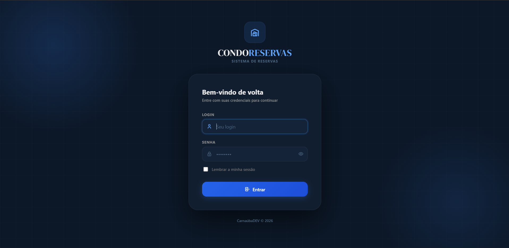
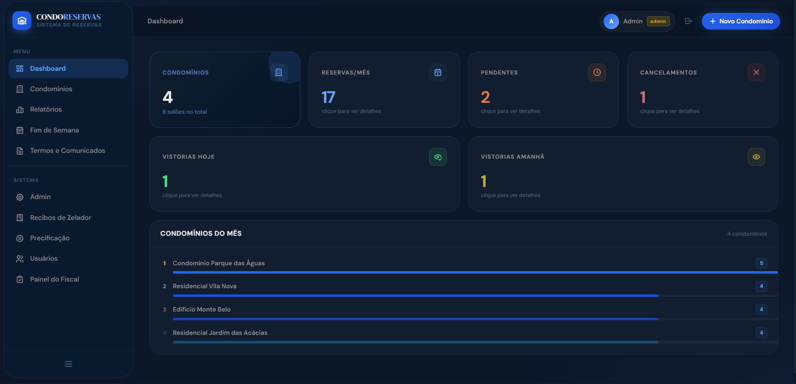
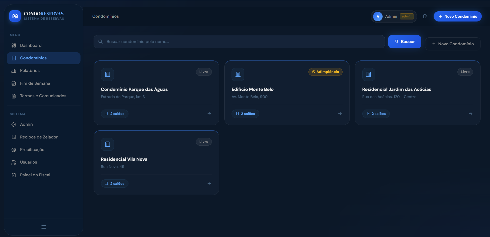
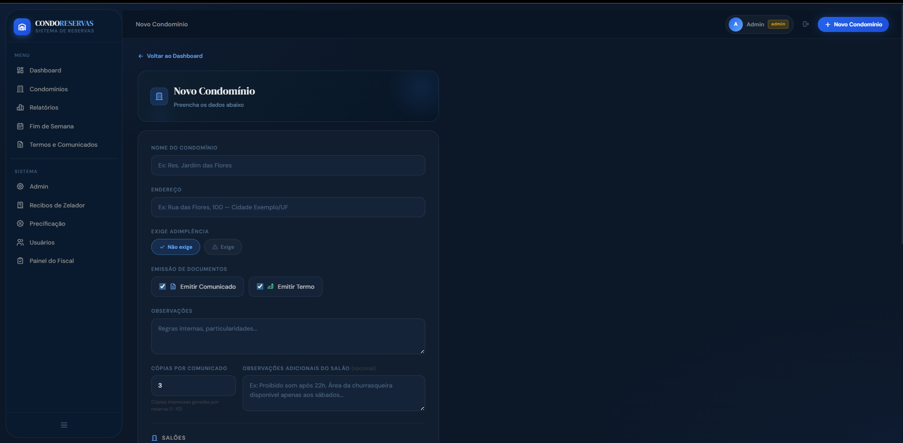
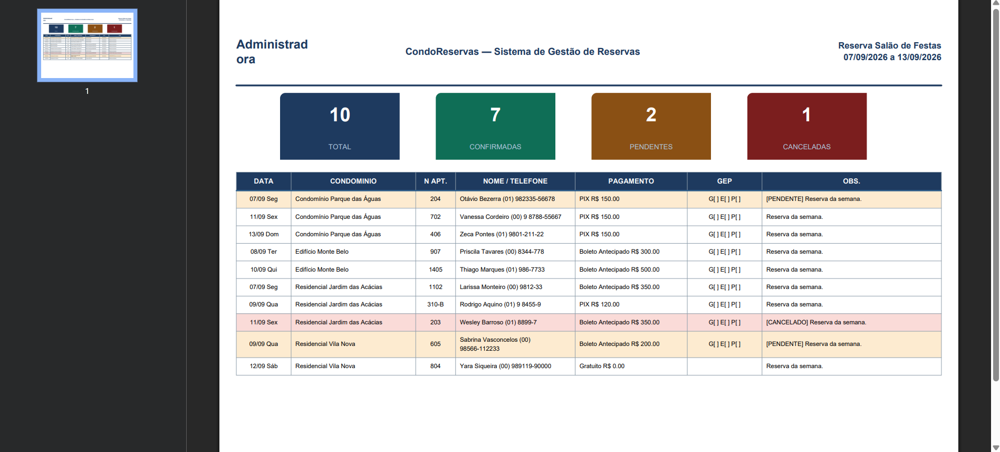
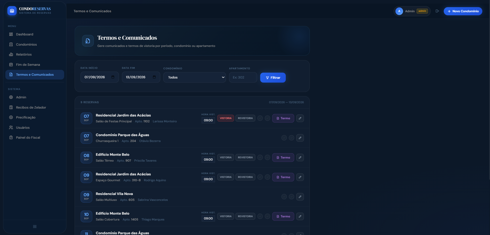
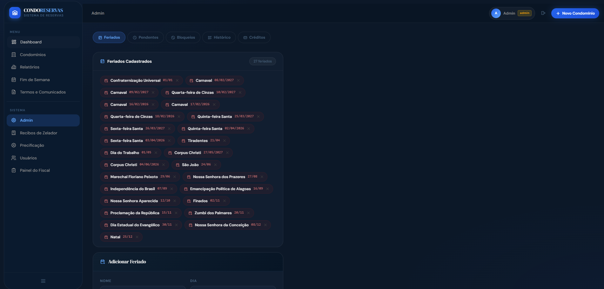

# CondoReservas


Sistema web para gestão de reservas de salão de festas em administradoras de condomínios. Nasceu para substituir uma planilha de Excel compartilhada que gerava conflitos de datas, retrabalho na emissão de documentos e zero rastreabilidade — hoje roda em produção atendendo dezenas de condomínios simultaneamente.

> **Nota:** este repositório é uma versão descaracterizada do sistema real, que está em produção atendendo uma administradora de condomínios de médio porte. Nomes de condomínios, marca, logo, CNPJ, e-mails e qualquer dado real de cliente foram removidos ou substituídos por exemplos fictícios. A lógica de negócio, a arquitetura e o código são os mesmos da produção.

---

## Sobre o projeto

Antes do sistema, cada reserva de salão era uma linha em planilha: sem trava de conflito de data, sem histórico de quem alterou o quê, e cada comunicado ou termo de vistoria era montado manualmente. O CondoReservas centraliza toda essa operação — do calendário de reservas até a emissão de PDFs — numa aplicação web única, com controle de acesso por perfil e trilha de auditoria completa.

O sistema foi desenhado e evoluído junto com o uso real: boa parte das regras de negócio (bloqueio mútuo de salões, isenção anual por apartamento, recibo condicional de zelador) nasceu de casos concretos identificados em produção, não de especificação prévia — o que se reflete na cobertura de casos-limite do código.

---

## Funcionalidades

- **Calendário mensal interativo** por condomínio, com cores por status (confirmado, pendente, cancelado, feriado)
- **Bloqueio mútuo entre salões** — grupos e combos (ex: salão + churrasqueira) que compartilham disponibilidade
- **Emissão de PDF e DOCX**: confirmação de reserva, comunicados ao condomínio, termos de vistoria, relatórios semanais/fim-de-semana, recibos de zelador
- **Festa do condomínio** — reservas do próprio condomínio (sem morador identificado) tratadas como caso de primeira classe em todo o sistema, não como exceção
- **Festas surpresa** — oculta o número do apartamento no comunicado impresso
- **Vistoria mobile** — fiscal registra vistoria com assinatura digital (signature pad) e fotos, com suporte a uso offline (Service Worker)
- **Isenção anual por apartamento** com controle de cota por salão, evitando duplo uso
- **Regras de precificação configuráveis** por salão e por dia da semana
- **Controle de documentos impressos** com filtro "apenas novos" para não reimprimir o que já saiu
- **Histórico automático** de toda ação relevante por usuário (quem reservou, cancelou, editou)
- **Créditos por apartamento** com banner automático no formulário quando há saldo disponível
- **Inventário por salão** conferido via checklist no termo de vistoria
- **Feriados fixos e variáveis** (nacionais, estaduais e municipais) destacados automaticamente no calendário
- **Painel administrativo** com gestão de usuários, regras, bloqueios de período e log de auditoria com retenção configurável
- **Emissão granular por condomínio** — cada condomínio decide se emite comunicado e/ou termo, ou dispensa ambos
- **Backup automático criptografado** local e off-site por e-mail, além de uma rotina de "plano de continuidade" que exporta as próximas reservas por CSV em caso de indisponibilidade do sistema

---

## Segurança

Este é um sistema de produção lidando com dados de moradores, então segurança não foi tratada como feature — foi tratada como requisito:

| Camada | O que é feito |
|---|---|
| Dados sensíveis | Nome, contato e apartamento do solicitante são criptografados em repouso com **Fernet (AES-128-CBC + HMAC)**, via `@hybrid_property` — a aplicação nunca guarda o dado em texto puro no banco |
| CSRF | Proteção ativa em **todos** os formulários via Flask-WTF |
| XSS | Sanitização de input livre com **bleach** antes de persistir qualquer texto que volta pra tela |
| Autorização | Controle de acesso por perfil (admin / fiscal / coordenador), aplicado nas rotas, não só escondido na UI |
| Auditoria (LGPD) | Log de auditoria de ações sensíveis com retenção de 30 dias, com limpeza automática agendada |
| Rate limiting | Flask-Limiter nas rotas de autenticação e formulários públicos |
| Backup | Backups criptografados (mesma chave Fernet) com rotina automática diária e cópia off-site por e-mail |
| Consultas com campo criptografado | Como `nome_solicitante`/`contato`/`apartamento` são criptografados, buscas textuais nesses campos não usam `ILIKE` direto no banco — são resolvidas em memória para não vazar padrão do texto cifrado |

---

## Arquitetura e decisões técnicas

- **Migração SQLite → PostgreSQL sem downtime perceptível**: o sistema nasceu em SQLite (uso interno, rede local) e foi migrado para PostgreSQL (Supabase → Railway) preservando IDs e relacionamentos, via script de migração dedicado (`migrate_sqlite_to_pg.py`)
- **Hybrid properties para campos criptografados**: os models expõem `reserva.nome_solicitante` como se fosse uma coluna normal, mas por baixo criptografam/descriptografam transparentemente — quem consome o model não precisa saber que o dado está cifrado
- **Migrations como fonte de verdade**: todo campo novo passa por Alembic, inclusive quando o campo nasce de uma correção de dado específico (backfill documentado na própria migration, não em script solto)
- **Geração de documentos server-side**: PDFs (ReportLab) e DOCX (python-docx) gerados sob demanda, sem dependência de serviço externo de renderização
- **Scheduler interno**: APScheduler cuida de rotinas recorrentes (limpeza de audit log, backups) sem precisar de um worker separado
- **Compressão e cache**: Flask-Compress com GZIP e templates com auto-reload controlado por ambiente

---

## Tecnologias

| Camada | Tecnologia | Uso |
|---|---|---|
| Backend | Python + Flask | Servidor, rotas, lógica de negócio |
| ORM | SQLAlchemy + Alembic | Modelagem e migrations versionadas |
| Banco | PostgreSQL (produção) / SQLite (dev local) | Persistência |
| Templates | Jinja2 | Renderização de HTML dinâmico |
| Frontend | Tailwind CSS (CDN) + JS vanilla | Estilização e interatividade |
| PDFs | ReportLab | Geração programática de documentos |
| DOCX | python-docx | Relatórios editáveis |
| Planilhas | openpyxl | Exportação de relatórios |
| Segurança | Flask-WTF, bleach, cryptography (Fernet) | CSRF, sanitização, criptografia em repouso |
| Scheduler | APScheduler | Rotinas automáticas (backup, limpeza de logs) |
| Deploy | Gunicorn + Railway | Servidor WSGI e hospedagem |

---

## Screenshots

> As capturas abaixo são do sistema rodando com dados fictícios (nenhum dado real de condomínio ou morador).

| Login | Dashboard |
|---|---|
|  |  |

| Lista de Condomínios | Cadastro de Condomínio |
|---|---|
|  |  |

| Relatório Semanal (exportado) | Termos e Comunicados |
|---|---|
|  |  |

| Painel Administrativo (feriados) |
|---|
|  |

---

## Instalação local

```bash
git clone https://github.com/VinyCarnauba06/Condo-Reservas.git
cd Condo-Reservas
python -m venv venv
source venv/bin/activate  # Windows: venv\Scripts\activate
pip install -r requirements.txt
```

Crie o arquivo `.env` na raiz (use `.env.example` como base):

```env
SECRET_KEY=gere_uma_chave_forte_aqui
ADMIN_PASSWORD=sua_senha_forte_aqui
DATABASE_URL=sqlite:///condoreservas.db
FLASK_ENV=development
FLASK_DEBUG=true
ENCRYPTION_KEY=gere_com: python -c "from cryptography.fernet import Fernet; print(Fernet.generate_key().decode())"
```

Rode as migrations e suba o servidor:

```bash
flask db upgrade
python run.py
```

Acesse `http://localhost:5000` — login `admin`, senha definida no `.env` (o usuário admin é criado automaticamente no primeiro boot, se não existir).

### Popular feriados nacionais/estaduais

```bash
python seed_feriados.py
```

### Popular dados de demonstração (dev)

```bash
python seed_demo.py
```

Popula o banco com um dataset fictício completo para explorar o sistema sem
cadastrar nada à mão. **Idempotente e aditivo** — cada item só é criado se
ainda não existir, então rodar de novo não duplica e não apaga nada. O
script garante o schema antes de inserir (`flask db upgrade` em
PostgreSQL; `db.create_all()` como fallback em SQLite) e delega os feriados
ao `seed_feriados.py`.

| Entidade | O que é criado |
|---|---|
| Usuários | Um por perfil — `admin`, `operador` (Marina, Rafael), `coordenador` (Patrícia), `fiscal` (João), `fiscal_fixo` (Antônio) — mais um operador inativo |
| Condomínios / salões | 4 condomínios, 8 salões — cobrindo dia inteiro, horário fixo, grupo + combo, fiscal próprio seg–sáb e condomínio que não emite termo |
| Inventário | Itens padrão por salão, usados no checklist do termo de vistoria |
| Reservas | ~50 no total: um lote de −3 a +2 meses (confirmadas, pendentes, canceladas, festa do condomínio, um par de vistoria combinada) e 10 na semana atual (segunda a domingo). Solicitante, apartamento e contato são fictícios — os telefones usam DDD inexistente (00/01) e contagem de dígitos fora do padrão, de propósito, para não baterem com número real |
| Vistorias digitais | Termos de vistoria + revistoria com itens conferidos, para reservas passadas que exigiam vistoria da administradora |
| Créditos | Um disponível e um já consumido, vinculado a uma reserva |
| Bloqueios | Períodos bloqueados, globais e por condomínio |
| Regras de precificação | Regra de isenção anual + cota já registrada por unidade |

Senha de todos os usuários de teste: `senha123!` (ou o valor de
`SEED_PASSWORD` no `.env`). Logins: `admin`, `marina`, `rafael`,
`patricia`, `joao.fiscal`, `antonio.fixo` (`carlos.antigo` é o inativo).

---

## Estrutura do projeto

```
condoreservas/
├── app/
│   ├── __init__.py           — factory do Flask, extensões, scheduler, bootstrap do admin
│   ├── models.py              — models SQLAlchemy (Condominio, Salao, Reserva, Usuario, AuditLog...)
│   ├── routes/
│   │   ├── auth.py            — login, logout, controle de sessão
│   │   ├── condominios.py     — condomínios, calendário, dashboard
│   │   ├── saloes.py          — CRUD de salões
│   │   ├── reservas.py        — criar, editar, cancelar reservas
│   │   ├── vistorias.py       — vistoria mobile, assinatura digital, fotos
│   │   ├── fiscal_fixo.py     — portal do fiscal fixo (dias de semana)
│   │   └── relatorios.py      — geração de PDF/DOCX/XLSX, admin, usuários, termos
│   ├── static/                — CSS, JS, service worker de vistoria offline
│   ├── templates/             — páginas HTML (Jinja2 + Tailwind)
│   └── utils/                 — utilitários de backup
├── migrations/                — histórico versionado de schema (Alembic)
├── docs/                      — documentação complementar
├── backup_encrypted.py        — backup local criptografado (Fernet)
├── backup_producao.py         — backup off-site por e-mail (pg_dump)
├── restore_encrypted.py       — restauração de backup criptografado
├── rotina_fuga.py             — exporta reservas dos próximos 15 dias em caso de indisponibilidade
├── migrate_sqlite_to_pg.py    — script de migração SQLite → PostgreSQL
├── seed_feriados.py           — popula feriados nacionais/estaduais/municipais
├── seed_demo.py               — popula dataset fictício de demonstração (idempotente)
├── run.py
├── requirements.txt
└── .env.example
```

---

## Deploy

Em produção o sistema roda no **Railway**, com PostgreSQL nativo:

```
web: flask db upgrade && gunicorn -w 2 --threads 4 --timeout 90 -b 0.0.0.0:$PORT run:app
```

Também existe um modo de deploy alternativo em servidor Windows interno (via **Waitress** + **NSSM** + **IIS** como proxy reverso), útil quando o requisito é rodar 100% em rede local sem depender de nuvem — documentado em `BACKUP.md`.

---

## Backup e continuidade

Três camadas independentes:

1. **Backup local criptografado** (`backup_encrypted.py`) — agendado diariamente, arquivo `.enc` cifrado com a mesma chave Fernet da aplicação
2. **Backup off-site por e-mail** (`backup_producao.py`) — dump do PostgreSQL enviado automaticamente para um e-mail configurado
3. **Rotina de emergência** (`rotina_fuga.py`, agendada via GitHub Actions) — se o sistema ficar indisponível, um CSV com as reservas dos próximos 15 dias já está na caixa de entrada de quem precisa continuar operando na planilha até o sistema voltar

Detalhes completos em [`BACKUP.md`](BACKUP.md).

---

## Licença

Distribuído sob a licença MIT. Veja [`LICENSE`](LICENSE) para mais detalhes.

---

Desenvolvido por **Vinícius Carnaúba** · Ciência da Computação
